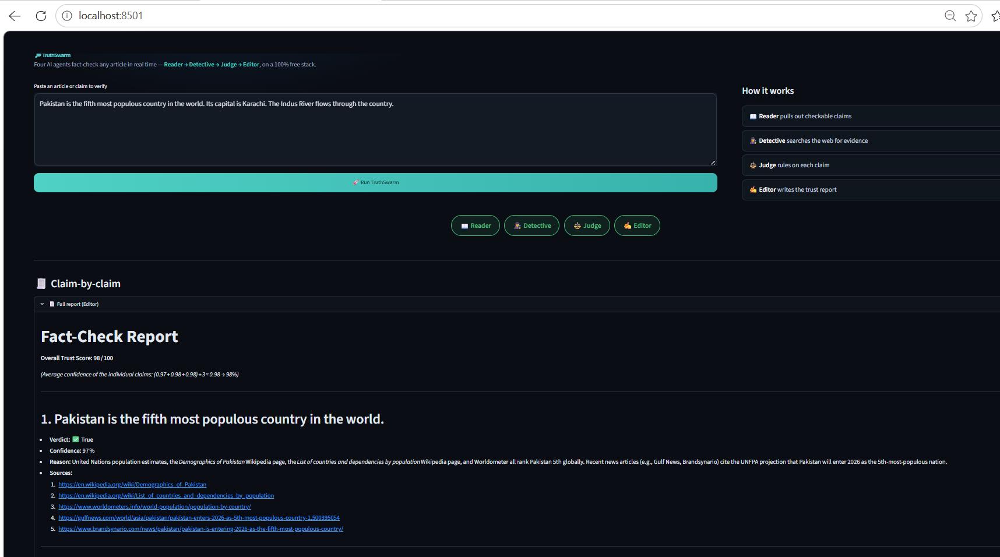
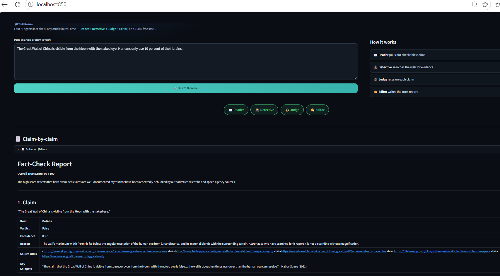

# 🔎 TruthSwarm

**A multi-agent AI system that fact-checks any article or claim in real time.**

## 🎥 Demo

![TruthSwarm demo]

> ▶️ **[Watch the full demo video](https://drive.google.com/file/d/1PZ3awt_Y9NedoFdPPNdvPiVwAdDkCrJB/view?usp=sharing)**

---

## What problem it solves

Manually fact-checking an article is slow: you have to isolate each claim, search for evidence, weigh the sources, and decide what's true. TruthSwarm automates that whole workflow with a coordinated team of AI agents, turning a paragraph of text into a sourced trust report in under a minute.

## How it works

TruthSwarm chains four specialized agents together as a **LangGraph** state machine:

| Agent | Job |
|-------|-----|
| 📖 **Reader** | Extracts every distinct, checkable factual claim from the text |
| 🕵️ **Detective** | Searches the web for evidence on each claim (rephrasing its query on a retry) |
| ⚖️ **Judge** | Rules each claim **True / False / Misleading / Unverifiable** with a confidence score |
| ✍️ **Editor** | Compiles an overall trust score, per-claim verdicts, and source links |

The agents hand work off to each other in sequence — and the pipeline **loops back**: when the Judge isn't confident about a borderline claim, it sends the Detective to search again before finalizing. That back-and-forth decision-making is what makes it *agentic* rather than a single fixed AI call.

```
Reader → Detective → Judge ──(confident?)──> Editor → Report
                       ▲                │
                       └── retry search ─┘
```

## 📸 Screenshots

**Mixed article — claims of different verdicts in one report:**



**A clearly false claim caught by the swarm:**



## Tech stack (100% free)

- **[LangGraph](https://langchain-ai.github.io/langgraph/)** — agent orchestration with a real retry loop
- **[Groq](https://console.groq.com/)** (`openai/gpt-oss-120b`) — fast LLM reasoning, free tier, no credit card
- **[DuckDuckGo](https://pypi.org/project/ddgs/)** (`ddgs`) — web search with no API key at all
- **[Streamlit](https://streamlit.io/)** — interactive web UI

## Setup

```bash
# 1. Clone
git clone https://github.com/zainab-10/truthswarm.git
cd truthswarm

# 2. Create a virtual environment
python -m venv venv
venv\Scripts\activate        # Windows
# source venv/bin/activate   # macOS / Linux

# 3. Install dependencies
pip install -r requirements.txt

# 4. Add your free Groq API key
#    Get one at https://console.groq.com  →  API Keys  →  Create
#    Then create a file named .env containing:
#    GROQ_API_KEY=gsk_your_key_here

# 5. Run
streamlit run app.py
```

The app opens at `http://localhost:8501`.

## Usage

Paste any article or claim into the text box and hit **Run TruthSwarm**. Watch the agent pipeline light up as each agent works, then read the trust score and per-claim verdicts below.

Try it on claims you already know:
- ✅ *"Water boils at 100 degrees Celsius at sea level."* → **True**
- ❌ *"The Great Wall of China is visible from the Moon with the naked eye."* → **False**
- ❓ *"My neighbor ate exactly 14 mangoes last Tuesday."* → **Unverifiable**

## Project structure

```
truthswarm/
├── app.py            # Streamlit frontend (UI, pipeline animation, verdict cards)
├── graph.py          # LangGraph agents + retry loop (Reader/Detective/Judge/Editor)
├── requirements.txt  # Dependencies
├── .env              # Your API key (not committed)
└── .streamlit/
    └── config.toml   # Dark theme config
```

## Notes & limitations

- **Free-tier limits shift over time.** If a model name is rejected, check [console.groq.com](https://console.groq.com/docs/models) for the current one and update it in `graph.py`.
- **DuckDuckGo can occasionally rate-limit** rapid searches; the code backs off and retries automatically.
- Verdict quality depends on the strength of freely available web results, so obscure claims may land on *Unverifiable*.
